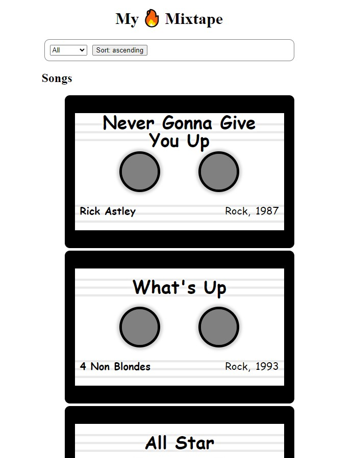

# Content Mixtape

## Table of contents

- [Overview](#overview)
  - [The challenge](#the-challenge)
  - [Screenshot](#screenshot)
  - [Links](#links)
- [My process](#my-process)
  - [Built with](#built-with)
  - [What I learned](#what-i-learned)
  - [Continued development](#continued-development)
- [Author](#author)

## Overview

### The challenge

Users should be able to:

- View the optimal layout for the app depending on their device's screen size
- Can select which music genre song you wish to see
- Can see the list from ascending or descending order

### Screenshot

### Links

- Live Site URL: [View](https://contextmixtape.netlify.app/)

## My process

- To start, we create a `MixtapeContext` using `React.createContext()` to store playlist data, and then create a `MixtapeProvider` component that wraps children with `MixtapeContext.Provider`.
- Inside this provider, we use `useState` to manage the `genre` (initially "all") and `sortOrder` (initially "ascending"), as well as the songs list, passing all these values and their setters into the context.
- In `App.js`, we wrap the application content in `MixtapeProvider`, passing the songs as a prop, and then render a `SongList` component to display the songs.
- The `SongList` retrieves songs, genre, and sortOrder using `useContext`, filters the songs by genre, and renders each using the `Song` component.
- Next, the `Controls` component provides a dropdown to change genres and a button to toggle between ascending and descending order.
- Lastly, in `SongList`, the songs are sorted by year based on the current sortOrder, ensuring proper display based on user input.

### Built with

- Semantic HTML5 markup
- CSS custom properties
- Mobile-Responsive Design
- JavaScript - Scripting language
- [React](https://reactjs.org/) - JS library

### What I learned

This was a class project to learn about context API.

### Continued development

maybe use later

## Author

- Website - [Cameron Howze](https://camkol.github.io/)
- Frontend Mentor - [@camkol](https://www.frontendmentor.io/profile/camkol)
- GitHub- [@camkol](https://github.com/camkol)
- LinkedIn - [@cameron-howze](https://www.linkedin.com/in/cameron-howze-28a646109/)
- E-Mail - [cameronhowze4@outlook.com](mailto:cameronhowze4@outlook.com)
